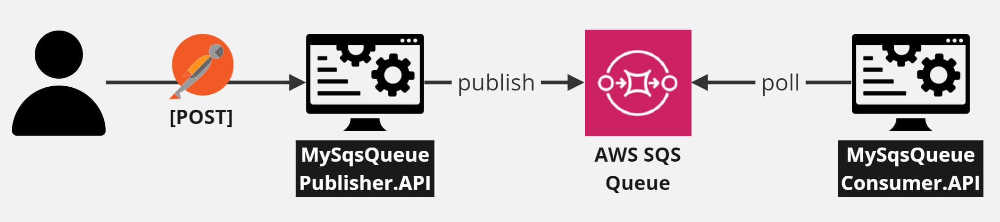

# PT_Demo_AWS

## Contents

- [General Information](#general-information)
- [SQS Queue Web API Producer with Web API Consumer](#sqs-queue-web-api-producer-with-web-api-consumer)
    - [Architecture](#architecture)
    - [Setup](#setup)
        - [Create SQS Queue in AWS](#create-sqs-queue)
        - [Create (Secret)AccessKey in AWS](#create-secretaccesskey-in-aws)
        - [Create MySqsQueuePublisher.API](#create-publisher-api)
        - [Create MySqsQueueConsumer.API](#create-consumer-api)
        - [Test](#test)
        - [Remove AWS Resources](#remove-aws-resources)
- [SQS Queue Web API Producer with Lambda Consumer](#sqs-queue-web-api-producer-with-lambda-consumer)
    - [Architecture](#architecture-1)
    - [Setup](#setup-1)
        - [AWS SQS Queue Setup](#aws-sqs-queue-setup)
        - [Web API Setup](#web-api-setup)
        - [AWS Lambda Setup](#aws-lambda-setup)
- [Links](#links)

## General Information

PT_Demo_AWS is a demo project to test both Lambdas and SQS Queues.

## SQS Queue Web API Producer with Web API Consumer

### Architecture



### Setup

#### Create SQS Queue in AWS

In AWS, create new SQS Queue `my-sqs-queue-test` in AWS:
- Type: `Standard`
- Configuration: `default`
- Encryption
    - Server-side encryption: `Disabled`
- Access policy
    - Choose method: `Basic`
    - Define who can send messages to the queue: `Only the queue owner`
    - Define who can receive messages from the queue: `Only the queue owner`
- Dead-Letter Queue: `disabled`

[Create Queue]

#### Create (Secret)AccessKey in AWS

In AWS, go to IAM > Dashboard > [Manage Access Keys] > Create new `AccessKey` and `SecretAccessKey` pair.

#### Create Publisher API

1. Create new .NET 6 Web API project `MySqsQueuePublisher.API`

2. Create new `MayaRequest.cs`

3. Create new `MayaController.cs` that injects `ISqsQueueService` through its constructor

4. Create new `SqsQueueService.cs`:

```
    public class SqsQueueService : ISqsQueueService
    {
        private readonly IConfiguration _configuration;

        public SqsQueueService(IConfiguration configuration)
        {
            _configuration = configuration;
        }

        public async Task<bool> PublishToAwsSqsQueueAsync(string body)
        {
            var sqsClient = new AmazonSQSClient();

            await SendMessage(sqsClient, _configuration.GetValue<string>("MySqsQueueTestUrl"), body);

            return true;
        }

        private static async Task SendMessage(IAmazonSQS sqsClient, string sqsUrl, string messageBody) { ... }
    }
```

5. Register `SqsQueueService` in `Program.cs`:

```
    public class Program
    {
        public static void Main(string[] args)
        {
            var builder = WebApplication.CreateBuilder(args);

            builder.Services.AddTransient<ISqsQueueService, SqsQueueService>();

            ...

            app.Run();
        }
    }
```

#### Create Consumer API

1. Create new .NET 6 Web API project `MySqsQueueConsumer.API`

2. Create new `SqsConsumer`:

```
    public class SqsConsumer : BackgroundService
    {
        private readonly IConfiguration _configuration;

        public SqsConsumer(IConfiguration configuration)
        {
            _configuration = configuration;
        }

        protected override async Task ExecuteAsync(CancellationToken stoppingToken) { ... }

        private static async Task Start(IAmazonSQS client, string queueUrl, CancellationToken stoppingToken) { ... }

        private static bool ProcessMessage(Message msg) { ... }

        private IAmazonSQS CreateClient() { ... }

        private static async Task<string> GetQueueUrl(IAmazonSQS client, string queueName) { ... }

        private static async Task<List<Message>> ReceiveMessageAsync(IAmazonSQS client, string queueUrl, int maxMessages = 1) { ... }

        private static async Task DeleteMessageAsync(IAmazonSQS client, string queueUrl, string id) { ... }
    }
```

3. Add `SqsConsumer` as Hosted Service in `Program.cs`:

```
    public class Program
    {
        public static void Main(string[] args)
        {
            var builder = WebApplication.CreateBuilder(args);

            builder.Services.AddHostedService<SqsConsumer>();

            ...
        }
    }
```

4. Take `AccessKey`, `SecretAccessKey` from step 2 and add them along with `MySqsQueueTestUrl` in `appsettings.json`:

```
{
  "Logging": {
    "LogLevel": {
      "Default": "Information",
      "Microsoft.AspNetCore": "Warning"
    }
  },
  "AllowedHosts": "*",
  "MySqsQueueTestUrl": "my-sqs-queue-test",
  "AccessKey": "...",
  "SecretAccessKey": "..."
}

```

#### Test

Publish:


Consume:


#### Remove AWS Resources

1. Delete the SQS Queue
2. Delete the AccessKey / SecretAccessKey through the AWS Management Console

## SQS Queue Web API Producer with Lambda Consumer

### Architecture


### Setup

#### AWS SQS Queue Setup

In the aws.amazon.com UI, create a new SQS Queue.  
With the UI, one can send a message.  
Then, from a CMD console, you can get the message using the following AWS command:  

```
aws sqs receive-message --queue-url https://sqs.eu-central-1.amazonaws.com/{id}/{queue-name}
````

Copy the URL of the SQS Queue and place it as a 'AwsSqsQueueUrl' variable in the Web API's appsettings.json.

---

### Web API Setup

Run AwsSqsQueueProducer.API locally on port 5194: http://localhost:5194 .

Having the SQS Queue URL in the **appsettings.json**, all incoming HTTP Post requests to http://localhost:5194/api/articles should be processed and resent through an **AmazonSQSClient** (coming from NuGet package **Amazon.SQS**) to the SQS Queue.

The format of the body of the Post request should be as follows:
```json
{
    "title": "title",
    "description": "description",
    "content": "content",
    "dateCreated": "2022-11-07",
    "authors": [
        {
            "firstName": "firstName1",
            "lastName": "lastName1",
            "age": 33
        },
        {
            "firstName": "firstName2",
            "lastName": "lastName2",
            "age": 22
        }
    ],
    "publishers": [
        {
            "name": "name",
            "datePublished": "2022-11-24"
        }
    ]
}
```
You should now be able to find all sent requests to Web API in the SQS Queue.  
You can get such messages from the queue using the aws command mentioned in section [AWS SQS Queue Setup](#aws-sqs-queue-setup).

---

#### AWS Lambda Setup

1. First, you need to configure your profile:

```
aws configure --profile {profile}
    AWS Access Key ID [********************]: {here}
	AWS Secret Access Key [********************]: {here}
	Default region name [eu-central-1]: eu-central-1
	Default output format [None]:
```

2. If you don't have the Amazon.Lambda.Tools installed, you need to execute the following command:

```
dotnet tool install -g Amazon.Lambda.Tools --version 5.4.1 --add-source https://api.nuget.org/v3/index.json
```

3. Next, you need to have the Amazon Lambda Templates installed:

```
dotnet new --install Amazon.Lambda.Templates::6.2.0
```

4. Then you can create your own Lambda project:

```
dotnet new lambda.EmptyFunction --name {project-name}
```

5. Implement the project by receiving a SQSEvent, processing it and sending its content to a personal email using an **AmazonSimpleEmailServiceClient** (coming from NuGet package **Amazon.SimpleEmail**).

6. If needed, configure again?

```
aws configure
    AWS Access Key ID [********************]: {here}
	AWS Secret Access Key [********************]: {here}
	Default region name [eu-central-1]: eu-central-1
	Default output format [None]:
```

7. Deploy the project in AWS:

```
dotnet lambda deploy-function {project-name} --add-source https://api.nuget.org/v3/index.json
    {enter role choice}
```

8. Go in the AWS UI, find your newly created Lambda and add a new Trigger of type 'SQS Trigger' and choose the SQS Queue name created in section  [AWS SQS Queue Setup](#aws-sqs-queue-setup).

9. Now every Post request you send to Web API should be processed and sent as a message to an AWS SQS Queue. This message should be processed by the AWS Lambda and sent via an email client to your personal email.  
That's it.

## Links

- https://medium.com/nuages-org/aws-sqs-background-service-net-5-part-1-63e3e730e3a2